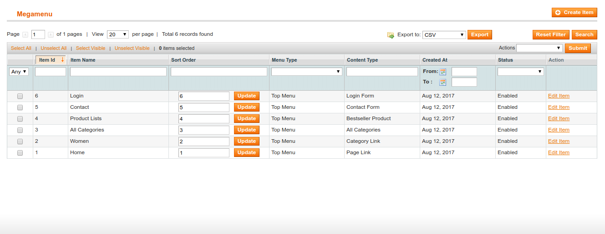
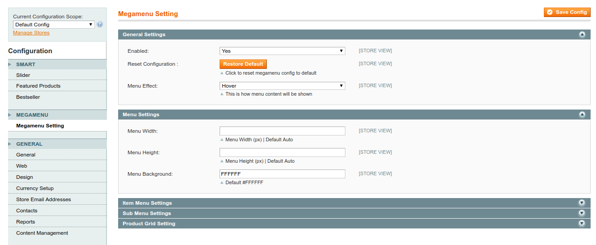

Mega Menu for Magento
==================

This extension replaces the default menu on Magento with a powerful, flexiable mega menu.


Development Stage
--------------

Alpha version for developer environment

Demo
--------------

Live demo on [http://magento.newbie-dev.net/](http://magento.newbie-dev.net/)


Install
------------

You can using [modman](https://github.com/colinmollenhour/modman) to install the extension as below:

```sh
$ cd /path/to/your/magento/directory
$ modman init
$ modman clone git@github.com:unetstudio/magento-mega-menu.git
```

### Update

Thanks for modman, you can grab latest changes from Github as like that:

```
$ modman update magento-mega-menu
```

### Management

Go to Admin > Magemenu > Management, after that you can create menu items.



### Configuration

You can easy to config for this extension, go to Admin > Store > Configuration > Unet Studio > Mega Menu.



### Changelog

- 1.1.0: Full features version.
